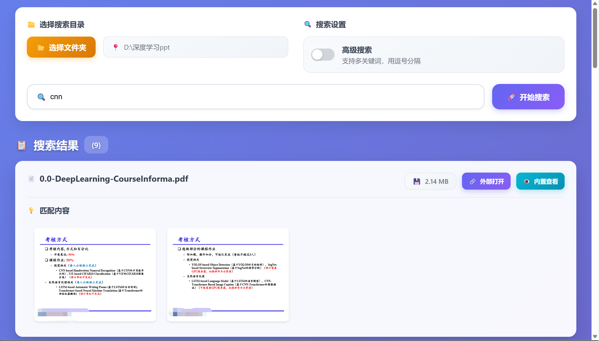
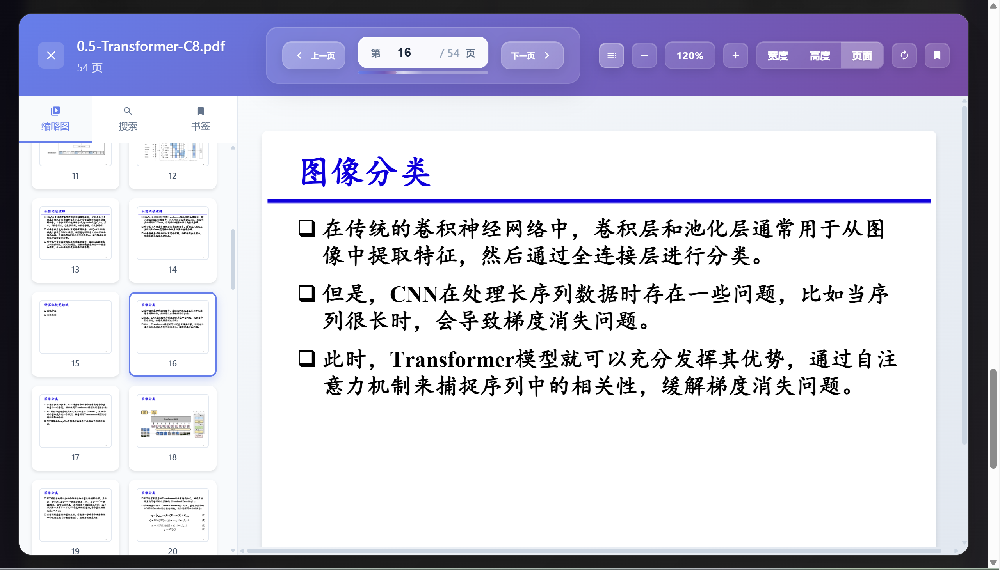

# PDF搜索工具 (PDF Searcher)

一个基于 Tauri + SvelteKit + TypeScript 开发的PDF文件搜索工具。

## 功能特性

- 🔍 快速搜索PDF文件内容
- 📁 支持文件夹批量搜索
- 💻 跨平台支持 (Windows, macOS, Linux)
- 🚀 高性能搜索引擎
- 📄 PDF文件预览

## 界面展示

*在主界面中，你可以选择文件夹进行搜索，输入关键词后点击搜索按钮即可开始搜索。*

*搜索结果以缩略图的形式展示，点击缩略图可以查看PDF文件的详细内容。*



## 开发环境

[VS Code](https://code.visualstudio.com/) + [Svelte](https://marketplace.visualstudio.com/items?itemName=svelte.svelte-vscode) + [Tauri](https://marketplace.visualstudio.com/items?itemName=tauri-apps.tauri-vscode) + [rust-analyzer](https://marketplace.visualstudio.com/items?itemName=rust-lang.rust-analyzer)

## 快速开始

### 安装依赖

```bash
npm install
```

### 开发模式

```bash
npm run tauri dev
```

### 构建应用

```bash
npm run tauri build
```

## CI/CD

本项目配置了 GitHub Actions 自动化构建：

### 持续集成 (CI)
- **触发条件**: push 到 main/master 分支或创建 Pull Request
- **功能**: 运行代码检查和测试
- **平台**: Ubuntu, Windows, macOS

### 自动发布 (Release)
- **触发条件**: 推送版本标签 (如 `v1.0.0`)
- **功能**: 自动构建并发布到 GitHub Releases
- **支持平台**: 
  - Windows (`.msi`, `.exe`)
  - macOS (`.dmg`) - 支持 Intel 和 Apple Silicon
  - Linux (`.deb`, `.AppImage`)

### 发布新版本

1. 更新版本号:
   ```bash
   # 更新 package.json 和 src-tauri/Cargo.toml 中的版本号
   npm version patch  # 或者 minor, major
   ```

2. 推送标签:
   ```bash
   git push origin v1.0.0  # 替换为实际版本号
   ```

3. GitHub Actions 将自动构建并创建 Release

## 项目结构

```
├── src/                 # SvelteKit 前端代码
├── src-tauri/          # Tauri 后端代码 (Rust)
├── static/             # 静态资源
├── .github/workflows/  # GitHub Actions 配置
└── build/              # 构建输出目录
```

## 技术栈

- **前端**: SvelteKit + TypeScript + Vite
- **后端**: Rust + Tauri
- **PDF处理**: pdf-extract, lopdf
- **构建工具**: Tauri CLI
- **CI/CD**: GitHub Actions
